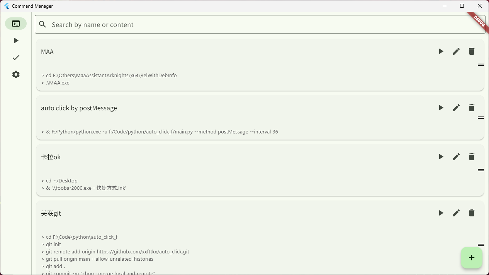
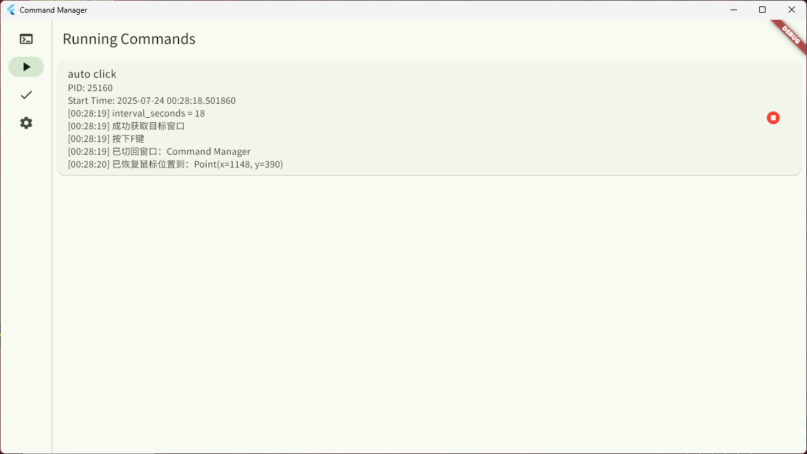
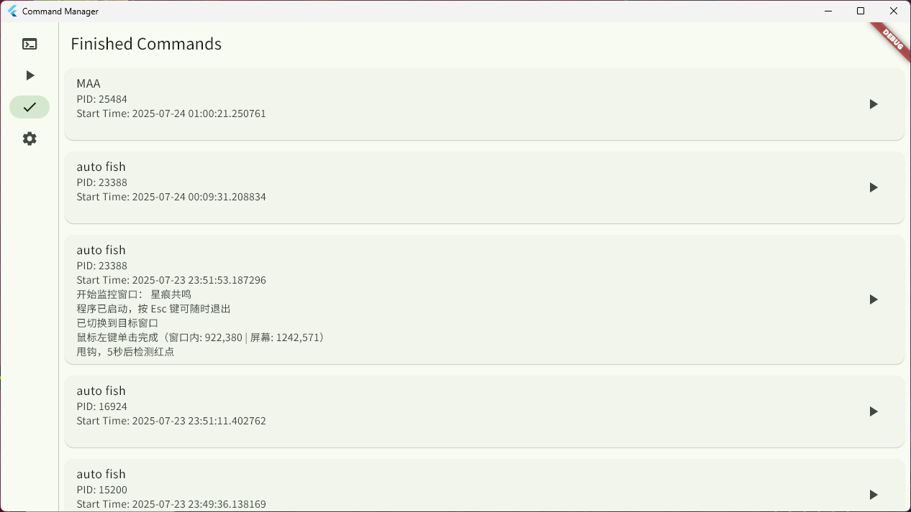
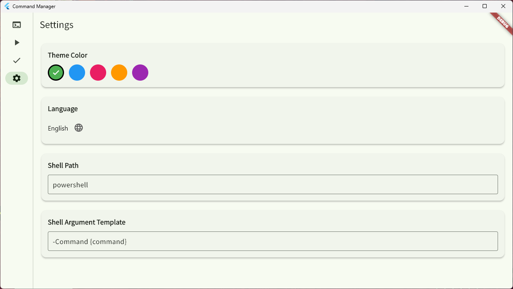

# Command Manager

A lightweight tool to manage, configure, and run custom command groups with ease — powered by Flutter.

## ✨ Features

- 📋 Create reusable **commands** (single or multiple shell commands)
- 🧩 Group multiple commands into one **action**
- 🎨 Material 3-style UI with dark/light theme support
- 🚀 Run commands via GUI with real-time output display
- 🔁 Reorderable actions for workflow customization

## 💡 Use Case Examples

- Run multiple setup scripts at once (e.g., `git pull` → `flutter pub get` → `build`)
- Save frequently used CLI tools and launch them from GUI
- Set up different project environments with a single click

## 🖥️ Platform

Currently optimized for **Flutter Desktop (Windows)**.
Theoretically compatible with other platforms supported by Flutter, though not fully tested.

## 📸 Screenshots

<p align="center">
  
  
</p>
<p align="center">
  
  
</p>

## 📦 Getting Started

```bash
git clone https://github.com/yourname/command_manager.git
cd command_manager
flutter pub get
flutter run -d windows
```

> ✅ Make sure you have Flutter desktop enabled: `flutter config --enable-windows-desktop`

## 📁 Project Structure

- `models/` – Data classes for Command, Action, etc.
- `pages/` – Main UI pages like Home, Finished, etc.
- `widgets/` – Reusable UI components
- `services/` – Execution, logging, persistence
- `viewmodels/` – Manages UI state and business logic

## 🧠 Concepts

- **Command**: A shell command (or group of commands) with description and arguments.
- **Action**: A list of commands run in sequence.
- **Finished Commands**: Logs of past executions (success/failure + stdout/stderr).

## 🛤️ Roadmap Ideas

- ✅ Run command groups from GUI
- [ ] Import/export commands as JSON
- [ ] Hotkey support
- [ ] Platform-aware command execution
- [ ] GitHub Actions integration?

## 🤝 Contributions

Contributions are welcome! Feel free to open issues or submit PRs.
